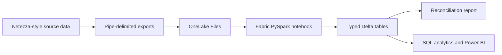

# IBM Netezza to Microsoft Fabric Integration Demo

A self-contained migration demo that generates deterministic IBM Netezza-style
exports and loads them into a Microsoft Fabric Lakehouse. No Netezza server is
required.

The project provides one deployment command that:

1. Generates pipe-delimited Netezza-style export files.
2. Creates or reuses a Fabric workspace on a specified capacity.
3. Creates or reuses a Lakehouse.
4. Uploads the exports and their manifest to OneLake.
5. Deploys and runs a PySpark notebook.
6. Writes typed Delta tables.
7. Validates row counts, sales totals, referential integrity, and Delta logs.

## Use case

An organization is modernizing an on-premises Netezza sales warehouse. Before
connecting the production appliance, the team wants to prove the target
architecture, data-type mappings, reconciliation controls, and repeatable
deployment process in Fabric.

This sample models the handoff from a Netezza external-table export to a Fabric
Lakehouse:



## Sample data

The fixed seed `20260824` produces the same dataset on every run.

| Table | Rows | Purpose |
|---|---:|---|
| `customer_dim` | 200 | Customer profile and segmentation |
| `product_dim` | 40 | Product catalog and pricing |
| `order_fact` | 1,500 | Order header and total |
| `order_line_fact` | 4,440 | Product-level order detail |

The generated baseline reconciles to:

| Metric | Value |
|---|---:|
| Gross sales | $12,974,389.75 |
| Discounts | $640,403.67 |
| Net sales | $12,333,986.08 |

Exports use a header row, `|` delimiters, UTF-8 encoding, and `\N` for null
values. `manifest.json` records the Netezza schema, row counts, SHA-256
checksums, generation seed, and expected financial totals.

## Type mappings

| Netezza source | Fabric/Spark target |
|---|---|
| `BIGINT` | `long` |
| `INTEGER` | `integer` |
| `NUMERIC(p,s)` | `decimal(p,s)` |
| `BOOLEAN` | `boolean` |
| `DATE` | `date` |
| `TIMESTAMP` | `timestamp` |
| `CHAR` / `VARCHAR` | `string` |

## Prerequisites

- Python 3.10 or later
- Azure CLI
- A Microsoft Fabric tenant and an active Fabric capacity
- Permission to create Fabric workspaces and assign the selected capacity
- Permission to create Fabric items and write to OneLake

Authenticate before deployment:

```powershell
az login
az account show
```

Install the Python dependency:

```powershell
python -m pip install -r requirements.txt
```

## Generate the synthetic exports locally

```powershell
python .\generate_netezza_data.py
```

Files are written to `data\netezza_export`. The generator fails if an order
references an unknown customer, a line references an unknown order or product,
or header and line totals do not reconcile.

Run the tests:

```powershell
python -m unittest discover -s .\tests -v
```

## One-command Fabric deployment

Find the Fabric capacity GUID in the Fabric admin experience or through the
Fabric REST API, then run:

```powershell
python .\deploy_to_fabric.py `
  --capacity-id <fabric-capacity-guid>
```

Optional names can be supplied:

```powershell
python .\deploy_to_fabric.py `
  --capacity-id <fabric-capacity-guid> `
  --workspace-name "IBM Netezza Fabric Integration Demo" `
  --lakehouse-name "NetezzaMigrationLakehouse" `
  --notebook-name "Load Netezza Synthetic Exports"
```

The command is idempotent for those names. It uses absolute GUID-based OneLake
paths, so the notebook does not depend on an attached default Lakehouse.
Deployment output is saved locally to the ignored `deployment-state.json`.

## Demo execution

1. Open the new **IBM Netezza Fabric Integration Demo** workspace.
2. Open **NetezzaMigrationLakehouse**.
3. Under **Files**, inspect `netezza_export\manifest.json` and the four `.tbl`
   exports.
4. Under **Tables**, show the four typed Delta tables.
5. Open **Load Netezza Synthetic Exports** and run all cells.
6. Inspect `Files\validation\load_report.json`.
7. Confirm all source and Fabric row counts match.
8. Confirm order sales and line sales both equal `$12,333,986.08`.
9. Confirm customer, order, and product orphan counts are all zero.
10. Use the Lakehouse SQL analytics endpoint for a business query:

```sql
SELECT
    c.industry,
    SUM(o.order_total) AS net_sales
FROM dbo.order_fact AS o
JOIN dbo.customer_dim AS c
    ON o.customer_id = c.customer_id
GROUP BY c.industry
ORDER BY net_sales DESC;
```

## Replace the simulation with a real Netezza source

Keep the Lakehouse tables and reconciliation pattern, but replace the local
generator with a supported ingestion path:

1. Configure the IBM Netezza ODBC driver on a reachable gateway host.
2. Create the Netezza connection in a Fabric Data Factory pipeline.
3. Use a self-hosted data gateway when Netezza is on a private network.
4. Copy each source table into the Lakehouse staging area.
5. Preserve source row counts and financial control totals in an audit
   manifest.
6. Run the included notebook logic, adapted to the pipeline output format.

See the [Microsoft Netezza connector
documentation](https://learn.microsoft.com/azure/data-factory/connector-netezza)
for supported connection properties and prerequisites.

## Project structure

```text
.
|-- data/netezza_export/          Generated sample exports and manifest
|-- fabric/load_netezza_exports.py
|-- tests/test_netezza_data.py
|-- deploy_to_fabric.py           End-to-end deployment and validation
|-- generate_netezza_data.py      Deterministic source-data generator
`-- requirements.txt
```

## Security

No credentials, access tokens, tenant IDs, workspace IDs, or capacity IDs are
stored in the repository. Authentication is delegated to the signed-in Azure
CLI identity.

## License

MIT
