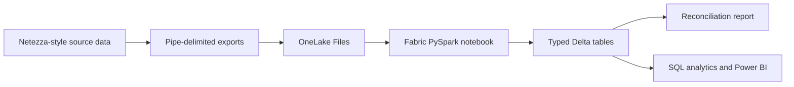

# IBM Netezza to Microsoft Fabric Integration Demo

A self-contained migration demo that generates deterministic IBM Netezza-style
exports and loads them into a Microsoft Fabric Lakehouse. No Netezza server is
required.

The project provides one deployment command that:

1. Generates pipe-delimited Netezza-style export files.
2. Creates or reuses a Fabric workspace on a specified capacity.
3. Creates or reuses a Lakehouse.
4. Uploads the exports and their manifest to OneLake.
5. Deploys and runs a PySpark notebook.
6. Writes typed Delta tables.
7. Validates row counts, sales totals, referential integrity, and Delta logs.

## Use case

An organization is modernizing an on-premises Netezza sales warehouse. Before
connecting the production appliance, the team wants to prove the target
architecture, data-type mappings, reconciliation controls, and repeatable
deployment process in Fabric.

This sample models the handoff from a Netezza external-table export to a Fabric
Lakehouse:



## Sample data

The fixed seed `20260824` produces the same dataset on every run.

| Table | Rows | Purpose |
|---|---:|---|
| `customer_dim` | 200 | Customer profile and segmentation |
| `product_dim` | 40 | Product catalog and pricing |
| `order_fact` | 1,500 | Order header and total |
| `order_line_fact` | 4,440 | Product-level order detail |

The generated baseline reconciles to:

| Metric | Value |
|---|---:|
| Gross sales | $12,974,389.75 |
| Discounts | $640,403.67 |
| Net sales | $12,333,986.08 |

Exports use a header row, `|` delimiters, UTF-8 encoding, and `\N` for null
values. `manifest.json` records the Netezza schema, row counts, SHA-256
checksums, generation seed, and expected financial totals.

## Type mappings

| Netezza source | Fabric/Spark target |
|---|---|
| `BIGINT` | `long` |
| `INTEGER` | `integer` |
| `NUMERIC(p,s)` | `decimal(p,s)` |
| `BOOLEAN` | `boolean` |
| `DATE` | `date` |
| `TIMESTAMP` | `timestamp` |
| `CHAR` / `VARCHAR` | `string` |

## Prerequisites

- Python 3.10 or later
- Azure CLI
- A Microsoft Fabric tenant and an active Fabric capacity
- Permission to create Fabric workspaces and assign the selected capacity
- Permission to create Fabric items and write to OneLake

Authenticate before deployment:

```powershell
az login
az account show
```

Install the Python dependency:

```powershell
python -m pip install -r requirements.txt
```

## Generate the synthetic exports locally

```powershell
python .\generate_netezza_data.py
```

Files are written to `data\netezza_export`. The generator fails if an order
references an unknown customer, a line references an unknown order or product,
or header and line totals do not reconcile.

Run the tests:

```powershell
python -m unittest discover -s .\tests -v
```

## One-command Fabric deployment

Find the Fabric capacity GUID in the Fabric admin experience or through the
Fabric REST API, then run:

```powershell
python .\deploy_to_fabric.py `
  --capacity-id <fabric-capacity-guid>
```

Optional names can be supplied:

```powershell
python .\deploy_to_fabric.py `
  --capacity-id <fabric-capacity-guid> `
  --workspace-name "IBM Netezza Fabric Integration Demo" `
  --lakehouse-name "NetezzaMigrationLakehouse" `
  --notebook-name "Load Netezza Synthetic Exports"
```

The command is idempotent for those names. It uses absolute GUID-based OneLake
paths, so the notebook does not depend on an attached default Lakehouse.
Deployment output is saved locally to the ignored `deployment-state.json`.

## Step-by-step demo execution

Allow approximately 15 minutes for this walkthrough. The deployment command
must have completed before starting.

### 1. Introduce the migration scenario

Explain that the source represents an on-premises Netezza sales warehouse. The
demo proves four parts of a modernization project:

1. Export data in a Netezza-compatible interchange format.
2. Land the unchanged source extracts in OneLake.
3. Convert source values into strongly typed Delta tables.
4. Reconcile the migrated data before it is released for analytics.

Point out that the simulation can be replaced with an actual Netezza connector
without changing the target Lakehouse design.

### 2. Review the generated Netezza exports

From the repository root, regenerate the deterministic source data:

```powershell
python .\generate_netezza_data.py
```

Open `data\netezza_export\manifest.json` and highlight:

- `format`: identifies the external-table export simulation.
- `delimiter`: confirms that fields are pipe-delimited.
- `null_value`: shows the Netezza-style `\N` null marker.
- `seed`: makes the sample repeatable.
- `tables`: documents source types, row counts, filenames, and checksums.
- `reconciliation`: records the source financial control totals.

Open `customer_dim.tbl` and `order_line_fact.tbl` to show the header row,
pipe-delimited values, and a `\N` customer loyalty value.

**Expected source baseline**

| Table | Expected rows |
|---|---:|
| `customer_dim` | 200 |
| `product_dim` | 40 |
| `order_fact` | 1,500 |
| `order_line_fact` | 4,440 |

### 3. Show the automated deployment

Run the deployment if it has not already been completed:

```powershell
python .\deploy_to_fabric.py `
  --capacity-id <fabric-capacity-guid>
```

Explain that this single command generates the files, creates or reuses the
workspace and Lakehouse, uploads the files, deploys the notebook, executes the
load, and validates the result.

At completion, review the JSON displayed in the terminal. Confirm:

- `notebook_run.status` is `Completed`.
- `source_reconciliation.row_counts` matches
  `fabric_load_report.row_counts`.
- `order_sales` and `line_sales` are both `12333986.08`.
- All three orphan counts are zero.

### 4. Inspect the Fabric workspace

1. Sign in to the [Microsoft Fabric portal](https://app.fabric.microsoft.com).
2. Open **Workspaces**.
3. Select **IBM Netezza Fabric Integration Demo**.
4. Confirm the workspace contains:
   - **NetezzaMigrationLakehouse**
   - **Load Netezza Synthetic Exports**
5. Open **NetezzaMigrationLakehouse**.
6. In the Explorer, expand **Files** and then `netezza_export`.
7. Confirm that `manifest.json` and the four `.tbl` files are present.
8. Expand **Tables** and confirm that the four Delta tables are registered.

This demonstrates the Bronze-like retention of source extracts alongside
analytics-ready Delta tables.

### 5. Walk through the transformation notebook

Open **Load Netezza Synthetic Exports** and explain the important sections:

1. `lakehouse_root` uses an absolute GUID-based OneLake path, allowing the
   notebook to run without a manually attached default Lakehouse.
2. `casts` maps Netezza data types to Spark data types.
3. Each `.tbl` file is read with a header, `|` separator, and `\N` null value.
4. Each DataFrame overwrites its corresponding Delta table with schema
   replacement enabled.
5. The final section compares order and line sales and checks all foreign-key
   relationships.
6. The results are persisted to
   `Files\validation\load_report.json`.

Select **Run all**. The notebook is idempotent, so rerunning it safely replaces
the demo tables.

**Expected result:** the run completes successfully and displays one row
containing the four table counts.

### 6. Validate the migration controls

In the Lakehouse Explorer, open
`Files\validation\load_report.json`. Confirm:

```json
{
  "row_counts": {
    "customer_dim": 200,
    "product_dim": 40,
    "order_fact": 1500,
    "order_line_fact": 4440
  },
  "order_sales": "12333986.08",
  "line_sales": "12333986.08",
  "orphan_orders": 0,
  "orphan_lines": 0,
  "orphan_products": 0
}
```

Compare this report with the `reconciliation` section in
`Files\netezza_export\manifest.json`. Explain that production migrations should
apply the same control pattern to every load batch.

### 7. Query the migrated data

From the Lakehouse, select **SQL analytics endpoint** and open a new SQL query.

First, verify the row counts:

```sql
SELECT 'customer_dim' AS table_name, COUNT(*) AS row_count
FROM dbo.customer_dim
UNION ALL
SELECT 'product_dim', COUNT(*) FROM dbo.product_dim
UNION ALL
SELECT 'order_fact', COUNT(*) FROM dbo.order_fact
UNION ALL
SELECT 'order_line_fact', COUNT(*) FROM dbo.order_line_fact;
```

Next, reconcile the two financial totals:

```sql
SELECT
    (SELECT SUM(order_total) FROM dbo.order_fact) AS order_sales,
    (SELECT SUM(line_total) FROM dbo.order_line_fact) AS line_sales;
```

Both columns should return `12333986.08`.

Finally, show a business insight by industry:

```sql
SELECT
    c.industry,
    COUNT(DISTINCT o.order_id) AS order_count,
    SUM(o.order_total) AS net_sales
FROM dbo.order_fact AS o
JOIN dbo.customer_dim AS c
    ON o.customer_id = c.customer_id
GROUP BY c.industry
ORDER BY net_sales DESC;
```

Explain that the migrated Delta tables are immediately available to SQL,
Power BI, notebooks, and downstream Fabric workloads without copying the data.

### 8. Demonstrate repeatability

Return to the terminal and run the same deployment command again:

```powershell
python .\deploy_to_fabric.py `
  --capacity-id <fabric-capacity-guid>
```

The script reuses the existing workspace, Lakehouse, and notebook, replaces the
source files and Delta tables, and runs all reconciliation controls again.

**Demo completion criteria**

- The Fabric notebook run has status `Completed`.
- All four Fabric row counts match the source manifest.
- Order sales equal line sales and the source net-sales total.
- Customer, order, and product orphan counts are zero.
- The SQL analytics endpoint returns the expected business results.

## Replace the simulation with a real Netezza source

Keep the Lakehouse tables and reconciliation pattern, but replace the local
generator with a supported ingestion path:

1. Configure the IBM Netezza ODBC driver on a reachable gateway host.
2. Create the Netezza connection in a Fabric Data Factory pipeline.
3. Use a self-hosted data gateway when Netezza is on a private network.
4. Copy each source table into the Lakehouse staging area.
5. Preserve source row counts and financial control totals in an audit
   manifest.
6. Run the included notebook logic, adapted to the pipeline output format.

See the [Microsoft Netezza connector
documentation](https://learn.microsoft.com/azure/data-factory/connector-netezza)
for supported connection properties and prerequisites.

## Project structure

```text
.
|-- data/netezza_export/          Generated sample exports and manifest
|-- fabric/load_netezza_exports.py
|-- tests/test_netezza_data.py
|-- deploy_to_fabric.py           End-to-end deployment and validation
|-- generate_netezza_data.py      Deterministic source-data generator
`-- requirements.txt
```

## Security

No credentials, access tokens, tenant IDs, workspace IDs, or capacity IDs are
stored in the repository. Authentication is delegated to the signed-in Azure
CLI identity.

## License

MIT
