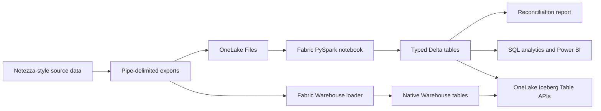

# IBM Netezza to Microsoft Fabric Integration Demo

A self-contained migration demo that generates deterministic IBM Netezza-style
exports and loads them into a Microsoft Fabric Lakehouse. No Netezza server is
required.

The Lakehouse deployment command:

1. Generates pipe-delimited Netezza-style export files.
2. Creates a new Fabric workspace on a specified capacity.
3. Creates or reuses a Lakehouse.
4. Uploads the exports and their manifest to OneLake.
5. Deploys and runs a PySpark notebook.
6. Writes typed Delta tables.
7. Validates row counts, sales totals, referential integrity, and Delta logs.

## Use case

An organization is modernizing an on-premises Netezza sales warehouse. Before
connecting the production appliance, the team wants to prove the target
architecture, data-type mappings, reconciliation controls, and repeatable
deployment process in Fabric.

This sample models the handoff from a Netezza external-table export to a Fabric
Lakehouse:



## Sample data

The fixed seed `20260824` produces the same dataset on every run.

| Table | Rows | Purpose |
|---|---:|---|
| `customer_dim` | 200 | Customer profile and segmentation |
| `product_dim` | 40 | Product catalog and pricing |
| `order_fact` | 1,500 | Order header and total |
| `order_line_fact` | 4,440 | Product-level order detail |

The generated baseline reconciles to:

| Metric | Value |
|---|---:|
| Gross sales | $12,974,389.75 |
| Discounts | $640,403.67 |
| Net sales | $12,333,986.08 |

Exports use a header row, `|` delimiters, UTF-8 encoding, and `\N` for null
values. `manifest.json` records the Netezza schema, row counts, SHA-256
checksums, generation seed, and expected financial totals.

## Type mappings

| Netezza source | Fabric/Spark target |
|---|---|
| `BIGINT` | `long` |
| `INTEGER` | `integer` |
| `NUMERIC(p,s)` | `decimal(p,s)` |
| `BOOLEAN` | `boolean` |
| `DATE` | `date` |
| `TIMESTAMP` | `timestamp` |
| `CHAR` / `VARCHAR` | `string` |

## Prerequisites

- Python 3.10 or later
- Azure CLI
- A Microsoft Fabric tenant and an active Fabric capacity
- Permission to create Fabric workspaces and assign the selected capacity
- Permission to create Fabric items and write to OneLake
- Microsoft ODBC Driver 17 or 18 for SQL Server when loading the Warehouse
- Delta Lake to Iceberg metadata conversion enabled for the Fabric tenant or
  workspace

Authenticate before deployment:

```powershell
az login
az account show
```

Install the Python dependency:

```powershell
python -m pip install -r requirements.txt
```

## Generate the synthetic exports locally

```powershell
python .\generate_netezza_data.py
```

Files are written to `data\netezza_export`. The generator fails if an order
references an unknown customer, a line references an unknown order or product,
or header and line totals do not reconcile.

Run the tests:

```powershell
python -m unittest discover -s .\tests -v
```

## One-command Fabric deployment

Find the Fabric capacity GUID in the Fabric admin experience or through the
Fabric REST API, then run:

```powershell
python .\deploy_to_fabric.py `
  --capacity-id <fabric-capacity-guid>
```

Optional names can be supplied:

```powershell
python .\deploy_to_fabric.py `
  --capacity-id <fabric-capacity-guid> `
  --workspace-name "IBM Netezza Fabric Integration Demo" `
  --lakehouse-name "NetezzaMigrationLakehouse" `
  --notebook-name "Load Netezza Synthetic Exports"
```

The workspace name must not already exist. Each run creates a fresh workspace
and fails before deployment if that name is already in use. The command uses
absolute GUID-based OneLake paths, so the notebook does not depend on an
attached default Lakehouse. Deployment output is saved locally to the ignored
`deployment-state.json`.

### Deploy from GitHub

[](https://github.com/salavala/fabric-netezza-integration-demo/actions/workflows/deploy-fabric.yml)

Use the
[Deploy to Microsoft Fabric workflow](https://github.com/salavala/fabric-netezza-integration-demo/actions/workflows/deploy-fabric.yml),
select **Run workflow**, and enter the Fabric capacity GUID, a unique new
workspace name, and the desired item names. The workflow creates the workspace,
deploys the Lakehouse demo, and can deploy the PyIceberg Table API notebook.
The Table API demo reads the Lakehouse immediately; it also reads the named
Warehouse when that optional item exists in the new workspace.

Fabric login credentials are intentionally not accepted as visible workflow
inputs. Add an Actions environment named `fabric`, create an environment secret
named `AZURE_CREDENTIALS`, and store this service-principal JSON:

```json
{
  "clientId": "<application-client-id>",
  "clientSecret": "<client-secret>",
  "subscriptionId": "<azure-subscription-id>",
  "tenantId": "<microsoft-entra-tenant-id>"
}
```

Configure the Fabric tenant to allow service principals to use Fabric APIs.
Grant the service principal permission to create workspaces and assign the
selected capacity. The identity also needs write access to OneLake. Never place
the client secret in workflow inputs, repository files, commit history, or
logs.

## Native Fabric Warehouse deployment

The second deployment script creates a new workspace and then creates
**NetezzaMigrationWarehouse**, connects to its Fabric SQL endpoint with the
signed-in Azure CLI identity, creates typed SQL tables, loads all four exports,
and runs the same reconciliation controls:

```powershell
python .\deploy_to_warehouse.py `
  --capacity-id <fabric-capacity-guid>
```

The script uses Microsoft Entra access-token authentication; it does not store
SQL credentials. Supply custom names when needed:

```powershell
python .\deploy_to_warehouse.py `
  --capacity-id <fabric-capacity-guid> `
  --workspace-name "IBM Netezza Fabric Integration Demo" `
  --warehouse-name "NetezzaMigrationWarehouse"
```

Deployment output is saved to the ignored
`warehouse-deployment-state.json`.

## Read tables through OneLake Iceberg Table APIs

`read_with_iceberg_api.py` uses the OneLake Iceberg REST Catalog endpoint to
discover namespaces, retrieve Iceberg v2 metadata and schemas, and then uses
PyIceberg to read the underlying OneLake data. It supports both the Lakehouse
and Warehouse created by this repository.

The API scope for each item is:

```text
<workspace-id>/<lakehouse-or-warehouse-item-id>
```

Run against both data items after both deployment scripts complete:

```powershell
python .\read_with_iceberg_api.py --require-tables
```

Run only against the Lakehouse:

```powershell
python .\read_with_iceberg_api.py `
  --items lakehouse `
  --require-tables
```

Run only against the Warehouse:

```powershell
python .\read_with_iceberg_api.py `
  --items warehouse `
  --require-tables
```

The script automatically:

1. Resolves the workspace and item IDs through the Fabric REST API.
2. Authenticates to OneLake with an Azure Storage audience token.
3. Calls `GET /v1/config` to obtain the Iceberg catalog prefix.
4. Lists namespaces and tables.
5. Retrieves Iceberg v2 metadata and column schemas for every table.
6. Reads table data through PyIceberg.
7. Returns three sample rows per table.
8. Reconciles row counts, order sales, and line sales.
9. Writes the result to the ignored `iceberg-api-report.json`.

Use `--require-tables` in automation. Without it, the script reports an item as
`incomplete` when its loader has not populated all four tables, while still
returning information for other ready items.

The APIs currently expose read-only metadata operations. Row access occurs
through the Iceberg metadata and OneLake storage locations returned by the
catalog. See the official [OneLake table APIs for Iceberg
overview](https://learn.microsoft.com/fabric/onelake/table-apis/iceberg-table-apis-overview)
and [getting-started
guide](https://learn.microsoft.com/fabric/onelake/table-apis/iceberg-table-apis-get-started).

### Deploy the Table API notebook to Fabric

Deploy and run the workspace-native version:

```powershell
python .\deploy_table_api_demo.py
```

The command creates or updates **OneLake Iceberg Table API Demo** in the
existing workspace, runs it, downloads its report, and validates the Lakehouse
counts and sales. The notebook:

1. Creates or reuses **Netezza PyIceberg Environment**.
2. Publishes PyIceberg 0.11.1 and PyArrow in that Fabric Environment, then
   attaches it to the notebook.
3. Gets a Fabric-managed Azure Storage token.
4. Uses PyIceberg with the OneLake Iceberg REST Catalog to discover schemas and
   read Lakehouse and Warehouse table rows as Arrow data.
5. Writes
   `Files\validation\iceberg_api_notebook_report.json` to the Lakehouse.

The published Environment avoids unreliable session-level package installation
in automated Fabric notebook jobs. The local `read_with_iceberg_api.py`
provides the equivalent external PyIceberg client demonstration.

## Presenter-ready step-by-step demo execution

Allow 20-25 minutes for the full walkthrough. The Lakehouse path and Table API
notebook can be presented without the Warehouse load. Treat the Warehouse
section as an optional extension until its tables are populated.

### Presenter preparation

Complete these steps before the audience joins:

1. Sign in with `az login`.
2. Confirm that **IBM Netezza Fabric Integration Demo** is visible in the
   Fabric portal.
3. Run the Lakehouse deployment if needed:

   ```powershell
   python .\deploy_to_fabric.py `
     --capacity-id <fabric-capacity-guid>
   ```

4. Deploy and run the Table API notebook:

   ```powershell
   python .\deploy_table_api_demo.py
   ```

5. Confirm that both commands report a completed notebook run.
6. Keep these browser tabs ready:
   - The Fabric workspace home page
   - **NetezzaMigrationLakehouse**
   - **Load Netezza Synthetic Exports**
   - **OneLake Iceberg Table API Demo**
   - The Lakehouse SQL analytics endpoint
7. Keep `data\netezza_export\manifest.json` open in an editor.

**Known current state:** the Lakehouse catalog is `ready`. The Warehouse
catalog is reachable but reports `incomplete` until
`deploy_to_warehouse.py` successfully populates its four tables. This status
does not prevent the main demo from completing.

### 1. Set the business context - 1 minute

**Say**

> We are modernizing an on-premises IBM Netezza sales warehouse into Microsoft
> Fabric. The goal is not only to move rows, but to preserve source fidelity,
> validate financial controls, provide immediate analytics, and expose the
> migrated tables through an open Iceberg interface.

Explain that the demo proves:

1. Netezza-compatible export generation.
2. Raw file retention in OneLake.
3. Typed Delta and optional Warehouse loading.
4. Automated reconciliation and referential-integrity controls.
5. SQL analytics without another data copy.
6. Open interoperability through OneLake Iceberg Table APIs.

### 2. Show the Netezza-style source - 2 minutes

**Do**

1. Open `data\netezza_export\manifest.json`.
2. Show `delimiter`, `null_value`, `seed`, `tables`, and `reconciliation`.
3. Open `customer_dim.tbl` and point out the pipe delimiter and `\N` null value.
4. Open `order_line_fact.tbl` and show product, quantity, discount, and total.

**Say**

> The source simulator behaves like a controlled Netezza external-table
> export. Every file has a checksum and expected row count, and the manifest
> carries financial totals that must survive the migration.

**Expected baseline**

| Table | Rows |
|---|---:|
| `customer_dim` | 200 |
| `product_dim` | 40 |
| `order_fact` | 1,500 |
| `order_line_fact` | 4,440 |

| Control total | Value |
|---|---:|
| Gross sales | $12,974,389.75 |
| Discounts | $640,403.67 |
| Net sales | $12,333,986.08 |

### 3. Explain the automated Lakehouse deployment - 2 minutes

**Do**

Show the command without rerunning it during a short presentation:

```powershell
python .\deploy_to_fabric.py `
  --capacity-id <fabric-capacity-guid>
```

If demonstrating automation live, run it and narrate the stages shown in the
terminal.

**Say**

> One command creates or reuses the workspace and Lakehouse, uploads the
> source exports to OneLake, deploys the transformation notebook, runs it, and
> blocks completion unless the migrated data reconciles.

**Verify in the command output**

- `notebook_run.status` is `Completed`.
- Source and Fabric row counts match.
- Order and line sales are both `12333986.08`.
- All orphan counts are zero.

### 4. Tour the Fabric workspace - 2 minutes

**Do**

1. Open [Microsoft Fabric](https://app.fabric.microsoft.com).
2. Select **Workspaces** > **IBM Netezza Fabric Integration Demo**.
3. Point out:
   - **NetezzaMigrationLakehouse**
   - **NetezzaMigrationWarehouse**
   - **Load Netezza Synthetic Exports**
   - **OneLake Iceberg Table API Demo**
4. Open **NetezzaMigrationLakehouse**.
5. Expand **Files** > `netezza_export`.
6. Show the manifest and four unchanged source exports.
7. Expand **Tables** and show the four typed Delta tables.

**Say**

> OneLake keeps the original migration evidence and the analytics-ready tables
> together. The raw exports support audit and replay, while Delta tables serve
> Fabric workloads.

### 5. Walk through the transformation notebook - 3 minutes

**Do**

Open **Load Netezza Synthetic Exports** and highlight:

1. The absolute GUID-based OneLake root.
2. The Netezza-to-Spark type-cast map.
3. Pipe-delimited input and `\N` null handling.
4. Delta overwrite with schema replacement.
5. Sales reconciliation and orphan checks.
6. The persisted `Files\validation\load_report.json` report.

Select **Run all** if time permits.

**Say**

> The notebook is deliberately idempotent. Rerunning the migration replaces
> this batch consistently instead of creating duplicates.

**Expected result:** the run completes and displays all four table counts.

### 6. Prove migration integrity - 2 minutes

**Do**

Open `Files\validation\load_report.json` and show:

```json
{
  "row_counts": {
    "customer_dim": 200,
    "product_dim": 40,
    "order_fact": 1500,
    "order_line_fact": 4440
  },
  "order_sales": "12333986.08",
  "line_sales": "12333986.08",
  "orphan_orders": 0,
  "orphan_lines": 0,
  "orphan_products": 0
}
```

Compare it with the source manifest.

**Say**

> A successful Spark job is not sufficient evidence of a successful
> migration. We separately prove completeness, financial agreement, and
> relationship integrity.

### 7. Show immediate SQL analytics - 3 minutes

**Do**

Open the Lakehouse **SQL analytics endpoint** and run:

```sql
SELECT 'customer_dim' AS table_name, COUNT(*) AS row_count
FROM dbo.customer_dim
UNION ALL
SELECT 'product_dim', COUNT(*) FROM dbo.product_dim
UNION ALL
SELECT 'order_fact', COUNT(*) FROM dbo.order_fact
UNION ALL
SELECT 'order_line_fact', COUNT(*) FROM dbo.order_line_fact;
```

Reconcile sales:

```sql
SELECT
    (SELECT SUM(order_total) FROM dbo.order_fact) AS order_sales,
    (SELECT SUM(line_total) FROM dbo.order_line_fact) AS line_sales;
```

Both values should be `12333986.08`.

Show an industry-level insight:

```sql
SELECT
    c.industry,
    COUNT(DISTINCT o.order_id) AS order_count,
    SUM(o.order_total) AS net_sales
FROM dbo.order_fact AS o
JOIN dbo.customer_dim AS c
    ON o.customer_id = c.customer_id
GROUP BY c.industry
ORDER BY net_sales DESC;
```

**Say**

> The migrated data is immediately available to SQL, Power BI, notebooks, and
> other Fabric workloads without copying it out of OneLake.

### 8. Present the OneLake Iceberg Table API notebook - 5 minutes

**Do**

1. Return to the workspace.
2. Open **OneLake Iceberg Table API Demo**.
3. Show how the notebook obtains a Fabric-managed Storage token.
4. Point out the `GET /v1/config` call and the
   `<workspace-id>/<item-id>` catalog scope.
5. Show the calls that list namespaces, list tables, and retrieve table
   metadata.
6. Highlight `format_version: 2`, the Iceberg schema, metadata location, and
   table location.
7. Show that Fabric Spark reads the OneLake locations returned by the catalog.
8. Select **Run all**.
9. At the bottom, show the item summary table.

**Expected result**

| Item | Status | Tables |
|---|---|---:|
| `NetezzaMigrationLakehouse` | `ready` | 4 |
| `NetezzaMigrationWarehouse` | `incomplete` until loaded | 0 |

Open
`Files\validation\iceberg_api_notebook_report.json` and show the Lakehouse
schemas, three sample rows per table, row counts, and reconciled sales.

**Say**

> OneLake translates Fabric table metadata into an Iceberg REST Catalog
> interface. An Iceberg-compatible engine can discover governed schemas and
> locations without a proprietary metadata export. The Warehouse status also
> demonstrates that the API reflects the actual state of each data item.

### 9. Show external PyIceberg access - optional, 2 minutes

**Do**

From the repository, run the currently ready Lakehouse path:

```powershell
python .\read_with_iceberg_api.py `
  --items lakehouse `
  --require-tables
```

Open `iceberg-api-report.json` and show:

1. The `dbo` namespace.
2. Four Iceberg v2 table definitions.
3. Translated column types.
4. Three rows read through PyIceberg from each table.
5. Matching order and line sales.

**Say**

> The previous notebook proved the managed Fabric experience. This command
> proves that an external open-source Iceberg client can discover and read the
> same OneLake data.

### 10. Add the Warehouse path - optional extension

After the Warehouse endpoint is ready, run:

```powershell
python .\deploy_to_warehouse.py `
  --capacity-id <fabric-capacity-guid>
```

Then rerun:

```powershell
python .\deploy_table_api_demo.py
python .\read_with_iceberg_api.py --require-tables
```

The presenter should now expect both data items to report `ready`, with four
tables and the same control totals.

**Say**

> Lakehouse and Warehouse can participate in the same open catalog story. The
> target engine can vary while OneLake remains the common governed data
> foundation.

### 11. Close with the value statement - 1 minute

Summarize the demo with four points:

1. **Lower migration risk:** deterministic files, checksums, and repeatable
   deployment.
2. **Control by design:** row counts, financial totals, and orphan checks gate
   success.
3. **Immediate business value:** migrated data is queryable through Fabric SQL
   and ready for Power BI.
4. **Open interoperability:** OneLake Iceberg Table APIs expose Fabric data to
   compatible external engines without creating another data copy.

**Demo completion checklist**

- Lakehouse deployment reports `Completed`.
- Four Lakehouse row counts match the source manifest.
- Order and line sales both equal `$12,333,986.08`.
- All orphan counts are zero.
- SQL analytics returns the expected totals.
- **OneLake Iceberg Table API Demo** reports the Lakehouse as `ready`.
- The external PyIceberg script reads all four Lakehouse tables.

## Replace the simulation with a real Netezza source

Keep the Lakehouse tables and reconciliation pattern, but replace the local
generator with a supported ingestion path:

1. Configure the IBM Netezza ODBC driver on a reachable gateway host.
2. Create the Netezza connection in a Fabric Data Factory pipeline.
3. Use a self-hosted data gateway when Netezza is on a private network.
4. Copy each source table into the Lakehouse staging area.
5. Preserve source row counts and financial control totals in an audit
   manifest.
6. Run the included notebook logic, adapted to the pipeline output format.

See the [Microsoft Netezza connector
documentation](https://learn.microsoft.com/azure/data-factory/connector-netezza)
for supported connection properties and prerequisites.

## Project structure

```text
.
|-- data/netezza_export/          Generated sample exports and manifest
|-- fabric/load_netezza_exports.py
|-- tests/test_netezza_data.py
|-- deploy_to_fabric.py           End-to-end deployment and validation
|-- deploy_table_api_demo.py      Deploys and runs the Iceberg API notebook
|-- deploy_to_warehouse.py        Native Warehouse load and validation
|-- fabric/read_with_iceberg_api.py
|-- generate_netezza_data.py      Deterministic source-data generator
|-- read_with_iceberg_api.py      OneLake Iceberg discovery and reads
`-- requirements.txt
```

## Security

No credentials, access tokens, tenant IDs, workspace IDs, or capacity IDs are
stored in the repository. Authentication is delegated to the signed-in Azure
CLI identity.

## License

MIT
